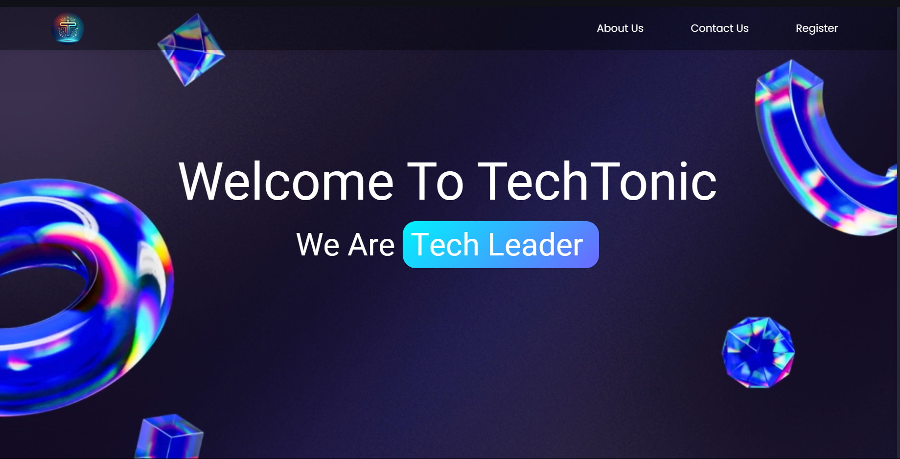
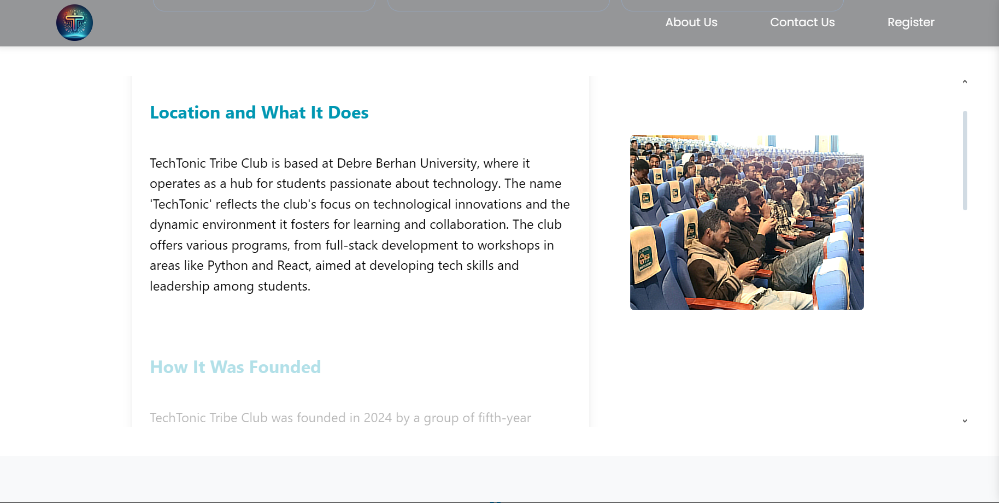

Great! Including screenshots and a demo video will make the README even more engaging and helpful for visitors. Here’s an updated README template with sections for screenshots and a demo video.

---

# TechTonic Tribe - Landing Page

Welcome to the **TechTonic Tribe**'s official GitHub repository for our club's portfolio and website! This project serves as a landing page for our organization, showcasing our mission, values, team, and the services we offer.

## Table of Contents
1. [Project Overview](#project-overview)
2. [Features](#features)
3. [Technologies Used](#technologies-used)
4. [Screenshots](#screenshots)
5. [Demo Video](#demo-video)
6. [Installation](#installation)
7. [Usage](#usage)
8. [Contributing](#contributing)
9. [License](#license)
10. [Contact](#contact)

## Project Overview

**TechTonic Tribe** is a club dedicated to fostering innovation, technology, and collaboration among its members. This landing page serves as our club's online presence, offering visitors insight into our goals, upcoming events, and resources. You can view the website live at [TechTonic Tribe's Website](https://techtonictribe.netlify.app/).
> **Note**: This website was built entirely from scratch, without reusing templates or existing code. The project is licensed under a prohibitive license to prevent reuse, redistribution, or modification outside of TechTonic Tribe.

## Features

- **Home Page:** Introduction to TechTonic Tribe's mission and values.
- **About Us:** Detailed information about our club, including its founding, objectives, and team.
- **Services:** Overview of the programs and services offered by TechTonic Tribe.
- **Contact:** Easy-to-use contact form for connecting with us.
- **Responsive Design:** Optimized for various devices, from mobile phones to desktops.

## Technologies Used

- **HTML5** and **Scss** for structure and styling
- **JavaScript/React(vite)** for interactive elements and dynamic content
- **Tailwind**  for responsive layout and components
- **Google font** and **React icons** for icons and visual elements

## Screenshots

Here are a few screenshots of the website:

*Home Page showcasing our mission and values.*

*About Us page introducing our team and goals.*

## Demo Video

To get more  overview of the website, watch our [demo video](./public/assets/demo.mp4) where we walk through the features and design of the TechTonic Tribe landing page.

## Usage

Once you have the project running, you can explore the various pages:

- **Home Page** displays our club’s mission and highlights.
- **About Us** introduces the team and provides background about our goals.
- **Services** showcases the offerings of TechTonic Tribe.
- **Contact** allows visitors to send inquiries directly.

Feel free to customize and adjust content as per your needs if you're using this template for other projects.

## Contributing

We welcome contributions to make TechTonic Tribe's landing page even better! To contribute:

1. Fork this repository.
2. Create a new branch (`git checkout -b feature/YourFeature`).
3. Commit your changes (`git commit -m "Add new feature"`).
4. Push to the branch (`git push origin feature/YourFeature`).
5. Open a Pull Request.

Please make sure your code is clean and follows best practices.

## License

This project is licensed under the MIT License - see the [LICENSE](LICENSE) file for details.

## Contact

For any questions, suggestions, or feedback, feel free to reach out to us:

- **Email:** [example@tectonictribe.com](mailto:example@tectonictribe.com)

Developed by :

- **GitHub:** [Fitsumhelina](https://github.com/Fitsumhelina)

---

